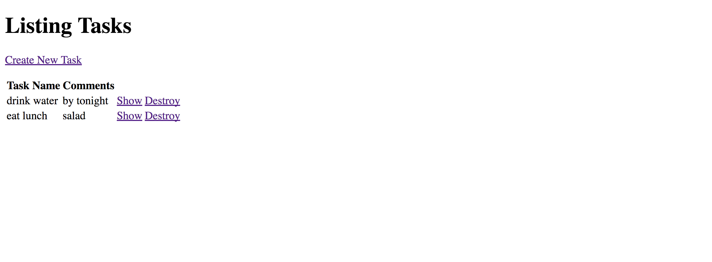

# Task Manager

I created a simple task manager application mainly to learn Ruby on Rails. I create one model, which is the Task model. In my Task Controller, I have a `new` controller action so users can create a new task. There is also a `create` controller action that actually saves the task in the database. The `index` action grabs all the tasks from the database, and the `show` action displays a specific task's name and comments based on the id. Lastly, there is a `delete` action that serves to allow users to delete a task they made.
